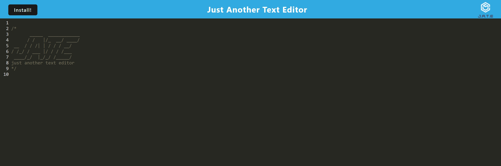

# Boot Camp - Module 19 - Progressive Web Applications (PWA) Challenge - Text Editor

## About

A single-page PWA text editor application that runs in the browser.

## Screenshot

## Technologies

HTML, CSS, JavaScript, Node.js, Express.js, IndexedDB API, Babel, webpack, Workbox, idb, concurrently, Markdown, Heroku, Git, GitHub, VS Code, Chrome, Firefox

## License

This project is licensed under the MIT License.

## Resources

[ Heroku Deployment Guide on Request-Response The Full-Stack Blog](https://coding-boot-camp.github.io/full-stack/heroku/heroku-deployment-guide)
